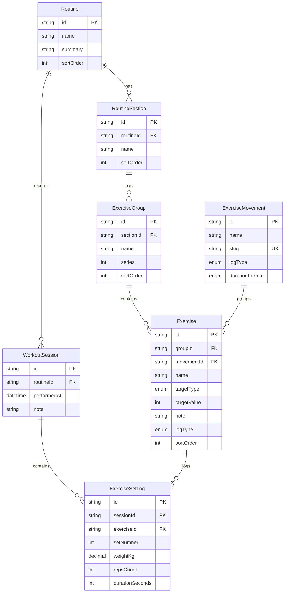

# Workout Database Schema

This document describes the current workout data model and how the main entities relate to each other.

## Key Concepts

- `Routine` is the user-facing workout template.
- `RoutineSection` and `ExerciseGroup` define the visible structure inside a routine.
- `Exercise` is the routine-specific slot the user logs inside a session.
- `ExerciseMovement` is the shared identity behind equivalent exercises across routines.
- `WorkoutSession` stores one saved session for one routine.
- `ExerciseSetLog` stores the logged values for a specific exercise inside a session.

## Entity Relationship Diagram

## Query Rules That Matter

- The progress page is shared by `ExerciseMovement`, not by `Exercise`.
- A movement can appear in more than one routine through multiple `Exercise` rows.
- The latest prefilled values for the workout form should come from the latest session for the shared `ExerciseMovement`.
- `durationFormat` controls how time values are presented in the UI.
  - `seconds`: regular time exercises like planks
  - `mmss`: cardio-style inputs such as `Correr`

## Example: `Correr`

`Correr` exists as:

- one shared `ExerciseMovement`
- three different `Exercise` rows, one per routine

That means:

- the progress page aggregates all `Correr` sessions together
- the workout form can prefill the latest `Correr` value across routines
- the saved value is still stored as `durationSeconds`
